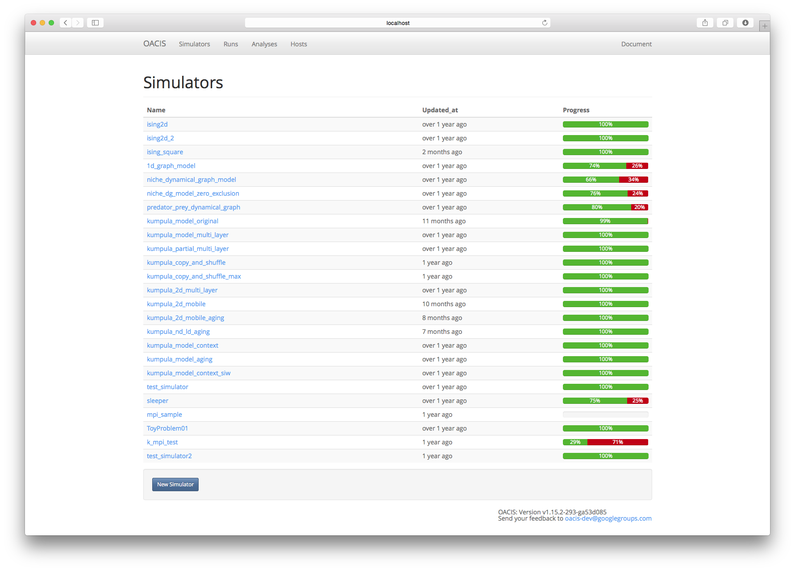
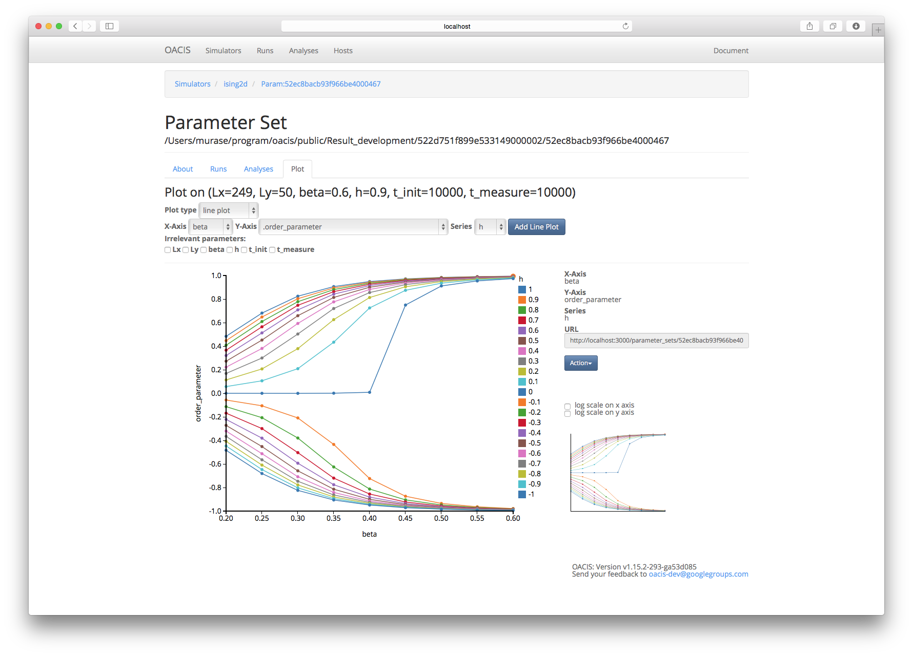
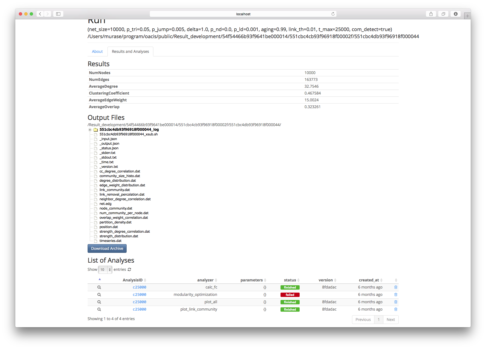

# OACIS

[](https://github.com/crest-cassia/oacis)
[](https://travis-ci.org/crest-cassia/oacis)

## What is OACIS?

*OACIS* (''Organizing Assistant for Comprehensive and Interactive Simulations'') is a **job management software** for large scale simulations.

As the number of simulation jobs increases, it is often difficult to keep track of vast and various simulation results in an organized way.

OACIS is a job management software aiming at overcoming these difficulties.
With a user-friendly interface of OACIS, you can easily submit various jobs to appropriate remote hosts.
After these jobs are finished, all the result files are automatically downloaded from the remote hosts and stored in a traceable way together with logs of the date, host, and elapsed time of the jobs.
It also provides APIs, which helps us automate parameter sweep, optimization of parameters, and sensitivity analysis etc.

If you have a trouble of handling many simulation jobs, OACIS will definitely help you!

## Screenshots






## A sample of APIs

A small sample of parameter sweep over parameters "p1" and "p2" of your simulator.
See http://crest-cassia.github.io/oacis/en/api.html for more details.
OACIS has both Ruby and Python APIs.

```ruby
sim = Simulator.where(name: "my_simulator").first

p1_values = [1.0,2.0,3.0,4.0,5.0]                                         # a standard way to make an array
p2_values = [2.0,4.0,6.0,8.0,10.0]
base_param = sim.default_parameters                                  # => {"p1"=>1.0, "p2"=>2.0, "p3"=>3.0}

host = Host.where(name: "localhost").first
host_param = host.default_host_parameters

# We are going to fix the parameters other than "p1" and "p2"
p1_values.each do |p1|                  # iterate over p1
  p2_values.each do |p2|                # iterate over p2
    param = base_param.merge({"p1"=>p1,"p2"=>p2})           #   => {"p1"=>p1, "p2"=>p2, "p3"=>3.0}
    ps = sim.find_or_create_parameter_set( param )          #   => ParameterSet of the given parameters
    runs = ps.find_or_create_runs_upto(5, submitted_to: host, host_param: host_param)  # creating runs under given parameter sets
  end
end
```

## Usage

Visit the [document](http://crest-cassia.github.io/oacis/) of OACIS. A docker image is also available.

## License

The MIT License (MIT)

Copyright (c) 2013-2017 RIKEN, AICS

Permission is hereby granted, free of charge, to any person obtaining a copy of
this software and associated documentation files (the "Software"), to deal in
the Software without restriction, including without limitation the rights to
use, copy, modify, merge, publish, distribute, sublicense, and/or sell copies of
the Software, and to permit persons to whom the Software is furnished to do so, 
subject to the following conditions:

The above copyright notice and this permission notice shall be included in all 
copies or substantial portions of the Software.

THE SOFTWARE IS PROVIDED "AS IS", WITHOUT WARRANTY OF ANY KIND, EXPRESS OR
IMPLIED, INCLUDING BUT NOT LIMITED TO THE WARRANTIES OF MERCHANTABILITY, FITNESS
FOR A PARTICULAR PURPOSE AND NONINFRINGEMENT. IN NO EVENT SHALL THE AUTHORS OR
COPYRIGHT HOLDERS BE LIABLE FOR ANY CLAIM, DAMAGES OR OTHER LIABILITY, WHETHER
IN AN ACTION OF CONTRACT, TORT OR OTHERWISE, ARISING FROM, OUT OF OR IN
CONNECTION WITH THE SOFTWARE OR THE USE OR OTHER DEALINGS IN THE SOFTWARE.


## Publications

- We would greatly appreciate if you cite the following article when you publish your research using OACIS.
    - Y. Murase, T. Uchitane, and N. Ito, "A tool for parameter-space explorations", Physics Procedia, 57, p73-76 (2014)
      - http://www.sciencedirect.com/science/article/pii/S187538921400279X
    - You can cite it as **"The systematic simulations in this study were assisted by OACIS."**, for example, in appendix or method section.

## Contact

- Please send your feedback to us.
    - `oacis-dev _at_ googlegroups.com` (replace _at_ with @)
    - We appreciate your questions, feature requests, and bug reports. Do not hesitate to give us your feedbacks.
- You'll have announcements of new releases if you join the following google group. Take a look at
    - https://groups.google.com/forum/#!forum/oacis-users

