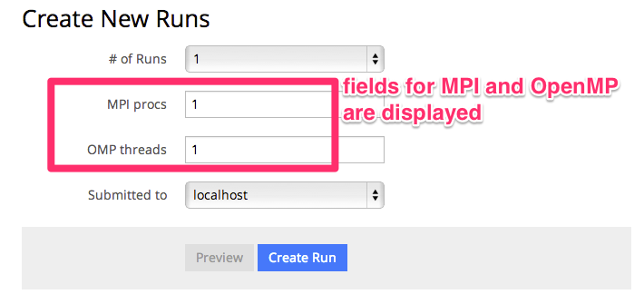

==========================================
高度な使い方
==========================================

スケジューラを経由してジョブを実行する
==========================================

| ジョブスケジューラー（Torqueなど）を経由してジョブを実行する方法について説明する。
| Host登録時にジョブスケジューラを指定する事にって、スケジューラのジョブ投入コマンド経由でジョブが実行されるようになる。
| 現在サポートされているスケジューラはTorqueとPJM(Fujitsu FX10で採用されているジョブスケジューラ)のみである。
| 以降ではTorqueにジョブを投げるケースを想定して説明する。

ジョブスクリプトのヘッダに特別な指定がいらないケース
----------------------------------------------

| シングルスレッド、シングルプロセスのジョブでジョブスクリプトのヘッダに特別な記述が必要ない場合は、Hostの登録時にスケジューラタイプとして *Torque* を選択するだけでよい。
| このようにセットしておけば、workerがジョブスクリプトをqsubコマンドで実行し、その際に取得したTorqueのジョブIDはRunと紐付けて記録される。
| workerは定期的に qstat コマンドで得られた結果をパースしてジョブの状態をモニターし、ジョブの完了後に計算結果を取得する。
| 実行中に異常終了した場合、途中までの結果をサーバーにダウンロードしRunのステータスを *failed* として記録する。
| 実行中にユーザーによってRunが削除された場合は、qdelコマンドを使用してジョブを停止させる。

| PJMの場合には pjsub, pjstat, pjdel コマンドを使用してジョブの管理を行う。

ジョブスクリプトのヘッダに変数を指定するケース
----------------------------------------------

| ジョブスクリプトのヘッダにスケジューラのパラメータ（使用時間、占有するノード数、使用メモリ量など）を指定する必要があるケースについて説明する。
| ここでは例としてMPIで並列化しているシミュレータを、Torqueのスケジューラを使って占有時間を指定して実行することを考える。

| ジョブスクリプトのヘッダに指定する変数は以下のようになる。
.. code-block:: sh

  #!/bin/bash
  #PBS -l nodes=2:ppn=4
  #PBS -l walltime=10:00
  ...

| ここでnodesが使用するノード数、ppnは各ノード内のプロセス数、walltimeが実行制限時間である。
| 各ジョブによってこれらの値が異なるため、Runの作成時にこれらの値を指定できるようにする。

| そのためにはホストパラメータと呼ぶ仕組みを使用する。
| ホストパラメータとして指定した変数は各Runの作成時に個別に入力することができ、その変数がホストのテンプレート部分に展開される。

| 具体的には以下の手順でHostの "template", "Definition of Host Parameters" というフィールドを設定する。
1. templateの変数展開をしたい部分を *<%= ... %>* という記号で囲む。今回の例ではヘッダ部分を以下のように編集する。
  .. code-block:: sh

    #!/bin/bash
    #PBS -l nodes=<%= nodes %>:ppn=<%= ppn %>
    #PBS -l walltime=<%= walltime %>
    ...

2. "Definition of Host Parameter"の部分に展開したい変数の変数名、デフォルト値、フォーマット（入力可能な形式を正規表現で指定）を入力する。
  今回の場合、以下のように設定する。（formatの部分は空でもよいが、設定しておくとRunの作成時に不正な値を入れるとエラーになるのでミスに気づきやすくなる。）

  * Name: nodes,    Default: 1, format: ^\d+$
  * Name: ppn,      Default: 1, format: ^\d+$
  * Name: walltime, Default: 10:00, format: ^(\d\d:)?\d\d:\d\d$

  .. image:: images/edit_host_template.png
    :width: 50%
    :align: center

  | この際、テンプレートとホストパラメータ定義が整合していないとエラーとなる。
  | テンプレートで展開する変数は必ずホストパラメータとして定義されている必要があり、ホストパラメータとして定義された変数はテンプレート中に現れなくてはならない。

| 以上でホストの設定は完了である。
| この設定後、Runの作成時に以下のようにホストパラメータを入力する箇所が現れる。
| 適切な値を入れて [Preview] ボタンをクリックするとジョブスクリプトのプレビューが表示される。
| [Create Run]をクリックするとRunが作成され、順番にジョブが投入される。

.. image:: images/new_run_with_host_params.png
  :width: 30%
  :align: center

MPI, OpenMPのジョブ
-------------------------------------------------------------

| MPI, OpenMPで並列化されたシミュレータの場合、実行時にMPIのプロセス数、OpenMPのスレッド数を指定することが必要となる。
| Simulator登録時に、 *Suppot MPI*, *Support OMP* のチェックを入れると、Runの作成時にプロセス数とスレッド数を指定するフィールドが表示されるようになる。

| ここで指定したプロセス数・スレッド数はテンプレートの中でそれぞれ *<%= mpi_procs %>*, *<%= omp_threads %>* という変数に展開される。
| Hostのテンプレートを確認すれば分かるとおり、OpenMPのスレッド数はジョブスクリプトの中で環境変数 *OMP_NUM_THREADS* に代入される。
| 同様にMPIのプロセス数は、mpiexec コマンドの -n オプションの引数に展開される。
| これによりシミュレータが指定したプロセス数・スレッド数で実行されるようにしている。

| つまりOpenMPで並列化しているシミュレータはOMP_NUM_THREADS環境変数を参照してスレッド数を決めるように実装されていなければならない。
| （ プログラム内で *omp_set_num_threads()* 関数で別途指定している場合は、当然ながらここで指定したスレッド数は適用されない）

| MPIで並列化している場合、プロセス数は *mpiexec* コマンドの引数で渡されるが、 *mpiexec* コマンド以外のMPIプロセス実行コマンドを指定したい場合はHostのテンプレートを編集すればよい。

| ジョブスクリプトのヘッダ部分でも <%= mpi_procs %>, <%= omp_threads %> 変数を展開することができる。
| これを利用するとMPIプロセス数に応じて確保するノード数を自動的に決めたりすることができる。
| 例として、Flat MPIのプログラムを、１ノードあたり８コアのマシンで実行することを考える。
| Hostのテンプレートに以下のように書くことで、ノード数が自動的に指定されるようになる。（ただし、プロセス数は８の倍数にする必要がある）

.. code-block:: sh

  #!/bin/bash
  #PBS -l nodes=<%= mpi_procs / 8 %>:ppn=8
  #PBS -l walltime=10:00
  ...

プリプロセスの定義
==============================================

| シミュレータによっては実際にシミュレーションジョブを開始する前に、入力ファイルを準備したりフォーマットを調整したりするプリプロセスが必要な場合がしばしばある。
| しかしプリプロセスを計算ジョブの中で行おうとすると以下のようなケースで問題になる。

  * スクリプト言語など入力ファイルの準備に使うプログラムが計算ノードにインストールされていないケース
  * 外部へのネットワークが遮断され入力用ファイルを準備するために外部からファイルを転送することができないケース
  * ファイルのステージングの都合により、ジョブの実行前にファイルをすべて用意する必要があるケース

| そこで、CMにはジョブの実行前にプリプロセスを個別に実行する仕組みを用意してある。
| このプリプロセスはジョブの投入前にログインノードで実行されるため上記の問題は起きない。
| ここではプリプロセスの仕様と設定方法を説明する。

| プリプロセスはジョブの投入前にworkerによってssh経由で実行される。
| workerの実行手順は

  1. 各Runごとにワークディレクトリを作成する
  2. SimulatorがJSON入力の場合、_input.jsonを配置する。
  3. Simulatorの *pre_process_script* フィールドに記載されたジョブスクリプトをワークディレクトリに配置し実行権限をつける。(_preprocess.sh というファイル名で配置される)
  4. _preprocess.sh をワークディレクトリをカレントディレクトリとして実行する。
    * この際Simulatorが引数形式ならば、同様の引数を与えて _preprocess.sh を実行する。この引数から実行パラメータを取得することができる。
    * 標準出力、標準エラー出力は _stdout.txt, _stderr.txt にそれぞれリダイレクトされる。
  5. _preprocess.sh のリターンコードがノンゼロの場合には、SSHのセッションを切断しRunをfailedとする。
    * failedの時には、ワークディレクトリの内容をサーバーにコピーし、リモートサーバー上のファイルは削除する。
  6. _preprocess.sh を削除する
  7. シミュレーションジョブをサブミットする。

| ただし、 Simulatorの pre_process_script のフィールドが空の場合には、上記3~6の手順は実行されない。

Analyzerの登録と実行
==============================================

| ジョブの実行後、実行結果に対してポストプロセス（Analyzer）を定義することができる。
| CMで定義できるAnalyzerには２種類存在する。
| 一つは各個別のRunに対して実行されるもの、もう一つはParameterSet内のすべてのRunに対して行われるものである。
| 前者の例としては、シミュレーションのスナップショットデータから可視化を行う、時系列のシミュレーション結果に対してフーリエ変換する、などがあげられる。
| 後者の例は、複数のRunの統計平均と誤差を計算することなどがあげられる。
| CMの用語として、Analyzerによって得られた結果はAnalysisと呼ばれる。AnalyzerとAnalysisの関係は、SimulatorとRunの関係のようなものである。

| Analyzerはサーバー上でバックグラウンドプロセスとして実行される。よってサーバー上でanalyzerが適切に動くように事前にセットアップする必要がある。
| ユーザーはAnalyzerの登録時に実行されるコマンドを入力する。そのコマンドがバックグラウンドで呼ばれて解析が実行されることになる。
| Simulatorの場合と同じように、実行日時や実行時間などの情報が保存され、結果はブラウザ経由で確認できる。

| またAnalyzer実行時に解析用のパラメータを指定して実行することもできる。
| 例えば、時系列データを解析するときに最初の何ステップを除外するか指定したい場合などに使える。
| Analyzerの登録時にパラメータの定義を登録することができる。

| 実行時には新規にそのAnalyzer専用のワーキングディレクトリが作られ、そこでAnalyzerとして定義されたコマンドが実行される。
| また解析対象となるRunの結果もワーキングディレクトリ以下に配置されるが、解析対象がRunかParameterSetかによって異なるため以下で個別に説明する。

Runに対する解析
----------------------------------------------

| ここではRunに対する解析の例として、時系列データを出すシミュレーションのanalyzerとして、時系列をグラフにプロットすることを考える。
| シミュレータが以下の形式のファイルをsample.datというファイル名で出力することとする。１列目が時刻、２列目がプロットするデータを表す。

.. code-block:: txt

  1 0.25
  2 0.3
  3 0.4
  ...

| Analyzerの実行時には、Runの結果は *_input/* というディレクトリに保存される。
| Analyzerはそのディレクトリにあるファイルを解析できるように実装する。

| 例として、入力の時系列をgnuplotでプロットする。
| 次に示すようなgnuplot入力ファイルを作成し、どこかのパス（例として ~/path/to/plotfile.pltというパスにする）に保存する。

.. code-block:: txt

  set term postscript eps
  set output "sample.eps"
  plot "_input/time_series.dat" w l

| これでAnalyzerの準備ができたので、CMに登録する
| Simulatorの画面を開き、[About]タブをクリックするとAnalyzerを新規登録するためのリンク[New Analyzer]が表示される。
| そのリンクをクリックすると下図のような登録画面が現れる。

.. image:: images/new_analyzer.png
  :width: 30%
  :align: center

| このページの入力フィールドにAnalyzerの情報を登録する。入力する項目は以下の通り。

============================= ======================================================================
フィールド                     説明
============================= ======================================================================
Name                          CMの中で使われるAnalyzerの名前。任意の名前を指定できる。各Simulator内で一意でなくてはならない。
Type                          Runに対する解析(on_run)、ParameterSetに対する解析(on_parameter_set)のどちらかから選ぶ
Definition of Parameters      解析時に指定するパラメータがあれば登録する。空でもよい。
Command                       実行するコマンド
Auto Run                      Runの終了後に解析が自動実行されるか指定する。
Description                   Analyzerに対する説明。入力は任意。
============================= ======================================================================

| ここでは、Nameを"plot_timeseries"、Typeをon_run、Definition of Parametersは空のまま、Auto Runはnoを指定する。
| コマンドには以下を入力する。

.. code-block:: sh

  gnuplot ~/path/to/plotfile.plt

| このようにAnalyzerを登録するとRunの実行後に"plot_timeseries"というAnalyzerを選択して実行できるようになる。
| 解析の結果は、runの結果同様にブラウザ上で閲覧することができる。

