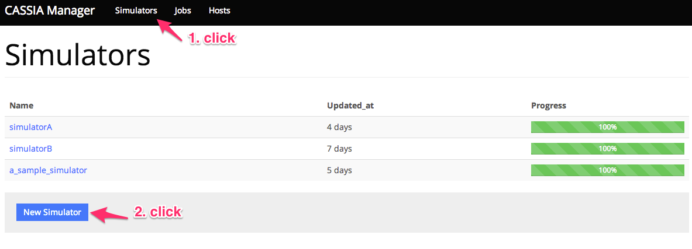
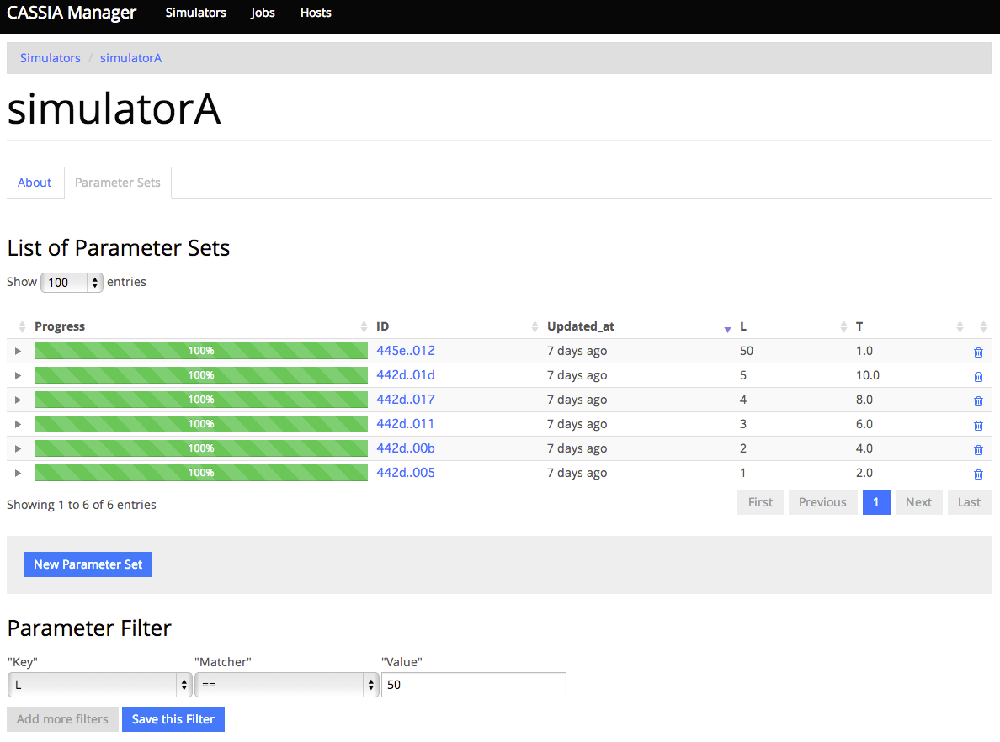
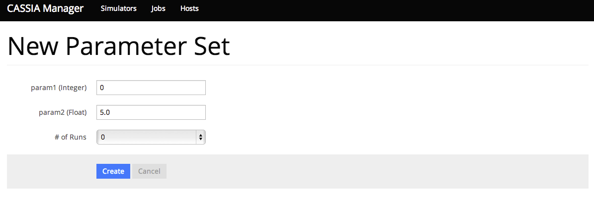
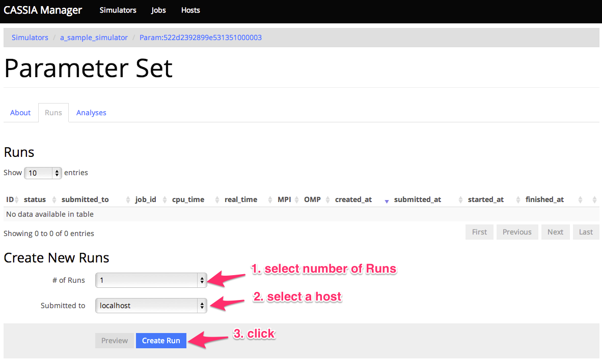
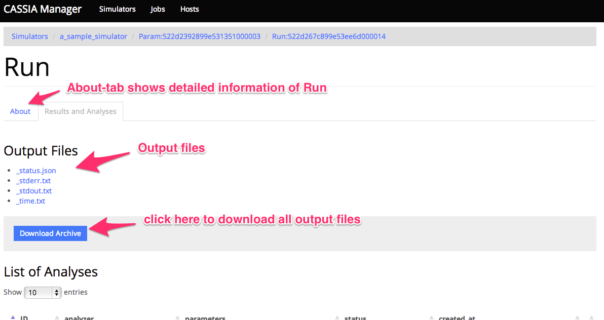

==========================================
基本的な使い方
==========================================

簡単なシミュレータを実際に実行し、結果を参照するまでの最小の手順をここで示す。

手順
================

0. ここで扱うシミュレータについて
1. ホスト登録
2. シミュレータ登録
3. パラメータセット登録
4. ジョブ投入
5. 実行中のジョブの確認
6. 結果の確認

ここで扱うシミュレータについて
---------------------------------------------

| このチュートリアルでは、２つの浮動小数点型のパラメータ"p1", "p2"を持つとする。
| このシミュレータは以下の様にパラメータと乱数の種を引数で受け取り実行できるように、各実行ホストでビルドをしておく。

::

~/path/to/simulator.out {p1} {p2} {seed}

パラメータをシミュレータに渡す方法として、JSONで渡す方法もある。シミュレータ登録の項目を参照の事。

ホスト登録
================================================

| シミュレータを実行するためのホストを登録する。
| 前提条件として、サーバーからシミュレータを実行するホストに鍵認証を使用してパスワード無しでSSHログインできるようにしておかなくてはいけない。
| ここでは鍵認証でリモートホストにSSHログインできるという前提で話を進める。

| ナビゲーションバーの[Hosts]をクリックし、[New Hosts]のボタンを押すと新規ホスト登録画面が表示される。

.. image:: images/hosts.png
  :width: 30%
  :align: center

| このページの入力フィールドにホストの情報を登録する。登録する項目は以下の通り。

============================= ======================================================================
フィールド                     説明
============================= ======================================================================
Name                          CMの中で使われるHostの名前。任意の名前を指定できる。一意でなくてはならない。
Hostname                      ssh接続先のhostnameまたはIPアドレス
User                          ssh接続時に使用するユーザー名
Port                          ssh接続先のポート番号。デフォルトは22。
SSH key                       ssh接続時の鍵認証で使用する秘密鍵ファイルへのパス。デフォルトは *~/.ssh/id_rsa*
Scheduler Type                ジョブスケジューラのタイプを指定する。スケジューラ無し、Torque、PJMの３種類から選択できる。
Work base dir                 ジョブが実行されるワークディレクトリが作られるパスを指定する。ここで指定したパス以下でジョブが実行される。
Max num jobs                  このホストに投入可能なジョブの最大数
MPI processes                 MPIプロセス数の最小値と最大値。Runを作成するときにここで指定した範囲外の値を指定しようとするとエラーになる。
OMP threads                   OMPスレッド数の最小値と最大値。Runを作成するときにここで指定した範囲外の値を指定しようとするとエラーになる。
Template                      ジョブ実行時に作成されるスクリプト（ジョブスクリプトと呼ぶ）のテンプレート。<%= ... %> の部分が変数展開される。
Definition of Host Parameters テンプレートで使用される変数（ホストパラメータと呼ぶ）の定義。変数名とデフォルト値、入力フォーマット（正規表現で指定）を指定する。
Executable simulators         実行可能なシミュレータをチェックボックスで指定する。
============================= ======================================================================

| 本チュートリアルでは以下のように設定する。その他はデフォルト。
| Work base dir は任意のディレクトリで良いが、新規作成した（他のファイルが無い）ディレクトリを指定する事。

- Name: localhost
- Hostname: localhost
- User: <自分のユーザー名>
- Work base dir: <任意の新規作成したパス>

シミュレータ登録
================================================

| 扱うシミュレータは、言語やマシンを問わず自由に作成できる。（CMは登録されたコマンドを実行するだけなので、どの言語で実装されているかは関係ない。）
| ただし、以下の要件を満たす必要がある。

- 出力ファイルがカレントディレクトリ以下に作成される事
    - CMは実行時にディレクトリを作り、その中でジョブを実行する。完了後、そのディレクトリ内のファイルすべてを出力結果として取り込む。
- パラメータの入力を引数またはJSONで受け付ける事
    - 引数渡しの場合はパラメータが定義された順番に引数で渡されて、最後の引数として乱数の種が渡される。
        - 例えば、param1=100, param2=3.0, seed(乱数の種)=12345 の場合、以下のコマンドが実行される
            .. code-block:: sh

              ~/path/to/simulator.out 100 3.0 12345

    - JSON形式の場合、実行時に次のような形式のJSONファイルを *_input.json* というファイル名でCMが実行時に配置する。シミュレータはカレントディレクトリの *_input.json* パースするように実装する必要がある。
        .. code-block:: json

          {"param1":100,"param2":3.0,"_seed":12345}

        - 乱数の種は _seed というキーで指定される。
        - 実行コマンドは以下のように引数なしで実行される。
            .. code-block:: sh

              ~/path/to/simulator.out

- 以下の名前のファイルがカレントディレクトリにあっても問題なく動作し、これらのファイルを上書きしたりしないこと
    - *_input.json* , *_output.json* , *_status.json* , *_time.txt*, *_version.txt*
    - これらのファイルはCMが使用するファイル名であるため干渉しないようにする必要がある
- 正常終了時にリターンコード０、エラー発生時に０以外を返す事
    - リターンコードによってシミュレーションの正常終了/異常終了が判定される。

| シミュレータはあらかじめ実行ホスト上でビルドしておき実行可能な状態で配置しておく必要がある。
| また複数のホストで実行する場合、シミュレータを同一のパスに配置する必要がある。
| 絶対パスで指定するよりもホームディレクトリからの相対パスで指定した方がホスト間の差異を吸収しやすい。

| Simulator一覧ページ(/simulators)で[New Simulator]ボタンをクリックすると新規シミュレータ登録画面が表示される。

| このページの入力フィールドにシミュレータの情報を登録する。登録する項目は以下の通り。

========================= ===============================================================================================
フィールド                 説明
========================= ===============================================================================================
Name                      シミュレータの名前。Ascii文字、数字、アンダースコアのみ使用可。一意でなくてはならない。
Definition of Parameters  シミュレータの入力パラメータの定義。パラメータの名前、型(Integer, Float, String, Boolean)、デフォルト値、パラメータの説明（任意）を入力する。
Preprocess Script         ジョブの前に実行されるプリプロセスを記述するスクリプト。空の場合はプリプロセスは実行されない。
Command                   シミュレータの実行コマンド。リモートホスト上でのパスを絶対パスかホームディレクトリからの相対パスで指定する。（例. *~/path/to/simulator.out*）
Input type                パラメータを引数で渡すか、JSONで渡すか指定する
Support mpi               シミュレータがMPIで実行されるか。チェックを入れた場合、mpiexecコマンド付きで実行される。
Support omp               シミュレータがOpenMPで並列化されているか。チェックを入れた場合、環境変数OMP_NUM_THREADSで並列数を指定して実行される。
Description               シミュレータの説明を入力する。（任意）
Executable_on             実行可能ホストを指定する。
========================= ===============================================================================================

| 本チュートリアルでは以下のように設定する。その他はデフォルト。

- Name: a_sample_simulator
- Definition of Parameters: [[param1, Integer, 0], [param2, Float, 5.0]]
- Command: ~/path/to/simulator.out
- Executable_on: localhostにチェック

パラメータセット登録
==============================================================

| Simulator一覧ページで登録したシミュレータ名のリンクをクリックすると、ParameterSet一覧画面が出る。
| 現時点では、ParameterSetが何も作られていないので空のテーブルが表示されるだけだが、ParameterSetを作成して行くと下図のように一覧で表示される。

| ParameterSetを新規作成するために[New Parameter Set]のボタンをクリックする。

| 上の様に登録フォームが現れるので、シミュレーションを実行したいパラメータを入力して[Create]をクリックする。
| （この画面からRunも作成する事ができるが、今回は「# of Runs」のフィールドは０のままにしておく。

| ちなみにこのときにコンマで区切って複数の値を入力すると、複数のParameterSetを同時に作成する事ができる。
| ただし同時に作ることができるParameterSetの数は100以下に制限しており、それを超えるとエラーになる。
| 既に存在するパラメータセットと同じものを作ろうとすると、エラーとなりエラーメッセージが表示される。

ジョブ投入
================================================

| Runを作成してシミュレーションを実行する。
| Create New Runsと書かれている箇所でRunの数と投入ホスト（Simulator登録時に実行可能ホストとして指定されたホストしか選択できない）を選択して[Create Run]ボタンを押す。
| 実行可能ホストが一つも表示されない場合は、Simulatorの登録時に実行可能ホストを指定し忘れたと考えられるので確認すること。

| SimulatorがMPI, OpenMPに対応している場合にはここでMPIプロセス数、OpenMPスレッド数を入力するためのフィールドも表示される。
| ホストに登録したMPIプロセス数、OpenMPスレッド数の最小値・最大値と整合しない場合はRunの作成時にエラーになる。

| 投入するホストがホストパラメータを定義したホストの場合も、ここでホストパラメータの入力が要求される。（ホストパラメータについての詳細は次章）

| また[Preview]ボタンをクリックすると、実際に投入されるジョブスクリプトをプレビューできる。
| ジョブがうまく実行できない場合はこちらを確認すると良い

| Runを作成するとバックグラウンドでリモートホストにジョブが投入される。
| ただしHostで指定された max_num_jobs がジョブの上限数で、それ以上のジョブは投入されない。実行中のジョブが完了し次第、順次ジョブ投入される。

実行中のジョブの確認
==================================================

| Navigationバーの[Jobs]をクリックすると、実行中(running)、スケジューラに投入済み(submitted)、実行待ち（created）のジョブの一覧を確認できる。
| この情報はバックグラウンドプロセスが１分ごとにリモートホストをポーリングして取得しているのでタイムラグがある場合がある。
| [Update]ボタンをクリックすると最新の情報に更新される。

.. image:: images/jobs.png
  :width: 30%
  :align: center

結果の確認
===================================================

| ジョブの実行が完了すると自動的に結果がサーバー内のデータベースに取り込まれる。
| Runの作成時のページにいくとRunの一覧が表示され、そのRunのステータスが *finished* になっている事が確認できる。
| (実行に失敗した場合、 *failed* というステータスになる。その際も結果のファイルはデータベースに格納されるので、そこからエラーの発生原因を調査できる。）

| 各RunをクリックするとRunの結果のファイルをブラウザから確認できる。
| カレントディレクトリ直下に作成されたファイルは、ブラウザが対応していれば直接参照できる。
| （シミュレータによって作成されたディレクトリやその中身については、Download Archiveボタンをクリックしダウンロードできる。）
| Aboutタブをクリックすると、実行日時・CPU時間などの詳細な情報を取得できる。
| データが格納されたパスも表示されるため、ブラウザ経由だけではなく直接そのパスから結果を取得する事もできる。

