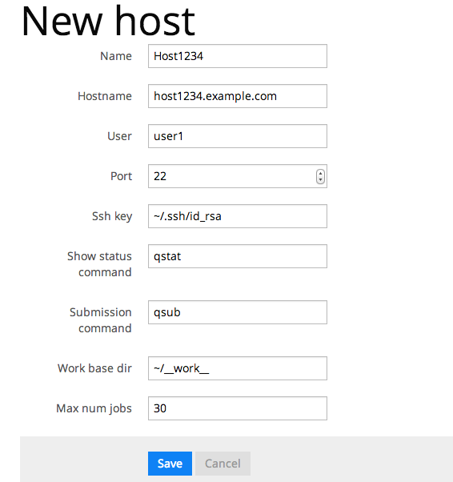

==========================================
How to Register Simulators and Hosts
==========================================

ここではCASSIA Manager(CM)にsimulatorおよびhostを登録する方法を説明する。

Registering Simulators
======================

CMを使ってsimulatorを実行するためには、simulator新規作成画面でsimulatorについての情報を登録する必要がある。
新規作成画面は、 http://localhost:3000/simulators にリンクがある。

.. image:: images/new_simulator.png
  :width: 30%
  :align: center

新規作成画面で登録する情報は以下の通りである。

* Simulatorの名前
* Parameterの定義。各パラメータについて以下のものを登録する。

  * 各パラメータの名前
  * タイプ(Integer, Flaot, String, Boolean)
  * デフォルト値
  * パラメータの説明（任意）

* 実行コマンド
* パラメータを渡す形式(引数 or JSON)
* 説明（任意）

Simulatorの名前、各パラメータの名前はアルファベットおよび'_'で構成される必要がある。空白やマルチバイト文字は不可。

実行コマンドは、絶対パスで指定する必要がある。
複数のホストで実行する事を考慮してホームディレクトリからの相対パスで記述するのが良い。
このコマンドを実行すれば動くように、事前に実行ホストで手動でビルドしてシミュレーターを配置する必要がある。

Parameterを渡す形式
-------------------

シミュレーターにパラメーターを渡す形式として、引数形式とJSON形式の２種類をサポートしている。

引数形式の場合、パラメータを登録した順に引数でパラメータを渡す。
例えば、L=100, T=10, N=5, seed(乱数の種)=12345 の場合、

.. code-block:: sh

  ~/simulator.out 100 10 5 12345

というコマンドが実行される。
コマンド引数をパースするようにシミュレーターを実装する必要がある。

JSON形式の場合、実行時に次のような形式のJSONファイルを _input.json というファイル名でCMが実行時に配置する。乱数の種は _seed というキーで指定される。

.. code-block:: json

  {"L":100,"T":10,"N":5,"_seed":12345}

実行コマンドは以下のように引数が渡されずに実行される。

.. code-block:: sh

  ~/simulator.out

シミュレーターはカレントディレクトリにある _input.json という名前のファイルを開き、JSONをパースするように実装する必要がある。

Requirements for Simulators
---------------------------

上記のパラメータのパース以外に、CMで実行するSimulatorは以下の要件を満たす必要がある。

* カレントディレクトリ以下に結果が出力される。
* 正常終了時に0, 異常終了時に0以外のリターンコードを返す。

CMは実行時にテンポラリなディレクトリを作成し、その中でシミュレーターを実行する。
終了後、そのディレクトリの中身（サブディレクトリ含む）を丸ごとCMに取り込むためカレントディレクトリ以下に結果のファイルが出力される必要がある。

またCMはリターンコードによってシミュレーターの正常終了、異常終了を判定している。
リターンコード０の場合はRunのステータスが *finished* に、０でない場合は *failed* になる。

Registering Host
=================

シミュレーターを実行するホストを登録する。
CMサーバーから実行ホストには鍵認証でパスワード入力無しでSSH接続できるようにセットアップしておく必要がある。

新規ホストの登録画面は http://localhost:3000/hosts にリンクがある。

新規ホスト登録画面で登録する情報は以下の通りである。

* 名前 : CM内での表示に使われる
* hostname : SSH接続するホスト名。この名前でアドレスが解決できる必要がある
* user : SSH接続時に使用するユーザー名
* port : SSH接続に使用するポート番号。通常は22
* ssh_key : SSH接続に使用する鍵のパス
* show_status_command : qstat などのホストのジョブキューの状態を確認するためのコマンド。（デフォルトは top)
* submission_command : qsub などのジョブをキューイングするためのコマンド。（デフォルトは nohup)
* work_base_dir : シミュレーターを実行するワークディレクトリ
* max_num_jobs : キューイングシステムに投入する最大のジョブ数

名前はアルファベットおよび'_'で構成される必要がある。空白やマルチバイト文字は不可。
work_base_dir で指定するディレクトリは書き込み可能になっている必要がある。
