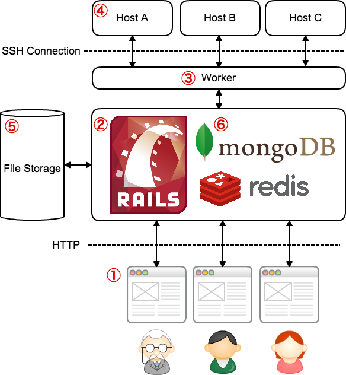

==========================================
システム概要
==========================================

この章では、CASSIA Managerの全体像の理解のために、システム構成とデータ構造について説明する。

システム構成
======================

| CASSIA Manager (CM) は、Ruby on Railsフレームワークを用いて構築されており、ユーザーはウェブブラウザを用いて実行したシミュレーション結果などにアクセスすることができる。
| 内部のデータベースとして MongoDB および Redis を使用しており、シミュレーション実行時の情報、パラメータについての情報、ホストについての情報などが格納される。
| シミュレータが出力したファイルについては、ファイルシステム上に保存される。
| システム構成の概要は下図のようになる。

| ユーザーからシミュレーション実行をリクエストされてから、シミュレーション結果をCMに保存するまでの処理の流れに沿ってシステムの概要を説明する。

1. まずユーザーがウェブブラウザ（①）上で実行したいシミュレーションを指定する。
2. リクエストはウェブサーバー上（②）で処理され、Workerと呼ばれるデーモンプロセス（③）に処理を依頼する。
  * Workerとはバックグラウンドで、リモートホストへのSSH接続やファイル転送などの時間がかかる処理を担当するプロセスである。
3. Workerはユーザーによって指定されたシミュレーションをリモートホスト（④）で実行する。
  * Host登録時にTorqueなどのジョブスケジューラを指定すれば、ジョブスケジューラ経由でジョブが実行される。
  * シミュレーターは事前にユーザーが各ホスト上でビルドして実行可能な状態になっている必要がある。
    * 事前にシミュレーターのパスをCMに登録し、Workerがそのコマンドをリモートホストで実行する。
  * 各ジョブごとにディレクトリを作成し、その中でジョブが実行される。
4. リモートホストでの実行が完了後、Workerが実行結果をCM実行サーバーにSFTPでダウンロードする。
  * Workerが定期的にリモートホストをポーリングし、ジョブが完了したかどうか確認する。
  * 結果はファイルストレージ（⑤）およびDB（⑥）に格納される。

| 格納された結果はブラウザからアクセス可能となる。

.. image:: images/ss_output_files.png
  :width: 30%
  :align: center

データ構造の概略
==============================

| CMではシミュレーション結果は図の様なSimulator, ParameterSet, Runの３層構造に分けて保存される。

.. image:: images/data_structure.png
  :width: 30%
  :align: center

| Simulatorは複数のParameterSetを持ち、ParameterSetは複数のRunを持っている。
| ParameterSetとはあるシミュレーターを実行するのに必要なパラメータの値の組をさす概念で、Runとは独立なモンテカルロランの一つをさす概念である。

| 例として、単純な交通流シミュレーターを考えよう。
| この交通流シミュレーターは、道路の長さL、信号周期T、車の台数Nを入力パラメータに持つシミュレーターだとする。
| ParameterSetとは、{L=100, T=10, N=10} などのパラメータの組み合わせのことをさす。
| このパラメータセットで乱数の種を変えて５回シミュレーションを行うとすると、５つのRunが作成されることになる。

| またそれぞれの結果に対して解析を実施する事もできる。
| その際には図のように解析対象（ParameterSet または Run）の配下に解析結果が格納される。

